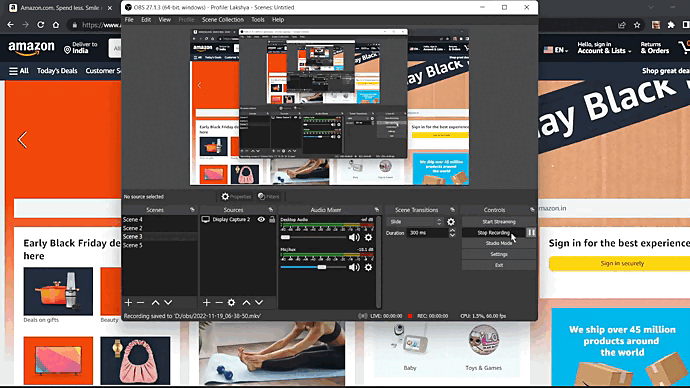

Amazon Book Downloader
----

> Download your favourite books directly from Amazon !

Demo
---

Setup
---

1. Clone this repo and cd into it
2. Go to manage extensions in Chrome and turn on Developer mode
3. Load unpacked > Choose the folder containing manifest.json
4. Open Amazon and enjoy

Features
---

- [x] automated search- without clicking on the search button 
- [x] Perform multiple queries with different pieces of the title
- [ ] (HARD) Directly get the download link instead of opening a new tab 
- [ ] speed up the getting link process?
- [ ] don't close the popup on clicking the link?
- [ ] !!! Add support for fiction books
- [ ] a slider to select the part of the book name to search, it has a default position